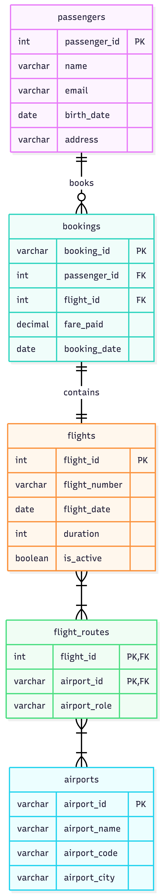

# ex603-airline-booking-database

Name: **TJ Gray** 

Chosen theme: Airline booking

What the system does: Relational database for an airline booking system that manages flights, bookings, passenger data, routes, and fares. 

This is a relational database for a flight booking application. This system manages the relationships between passengers, flights, bookings, airports, and routes. Actors are passengers who will be the primary user interacting with the application. The producer or supply side entity being acted upon are flights. The event is a booking, ultimately bookings will be the high activity record being created in the system. Airports are catalog, used to define the different options for a flight route. And the junction is flight routes, a table used to model a many to many relationship where many flights are associated to many airports. 

It must answer questions for customers and business users alike. The system provides information to passengers. A passenger may ask questions such as, what is the date of my booking, what is the duration of my flight, or what are the available flight routes. A business user will ask questions to understand what are the most frequented routes, what flight routes are not worth maintaining, and what is the average fare paid for a given set of constraints. The database knows the domain of every attribute to reject invalid state, using constraints as protection. Relationships are modeled across data structures using foreign keys to enforces is called referential integrity.

